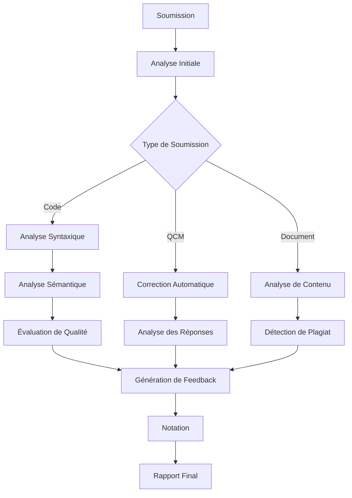

# Fonctionnalités d'Intelligence Artificielle

Notre plateforme CodeEval IA intègre des capacités avancées d'intelligence artificielle pour révolutionner l'évaluation des travaux académiques. Voici un aperçu détaillé des fonctionnalités IA implémentées dans notre système :

## Évaluation de Code

### Analyse Syntaxique Automatisée

Notre système effectue une analyse syntaxique approfondie du code soumis :

- **Détection d'erreurs** : Identification des erreurs de syntaxe et de compilation
- **Vérification de style** : Évaluation de la conformité aux conventions de codage
- **Suggestion de corrections** : Propositions d'amélioration pour les problèmes détectés

### Analyse Sémantique Intelligente

Au-delà de la syntaxe, notre IA évalue la qualité sémantique du code :

- **Évaluation algorithmique** : Analyse de l'efficacité et de la complexité des algorithmes
- **Détection de bugs logiques** : Identification des erreurs de logique qui ne provoquent pas d'erreurs de compilation
- **Vérification de robustesse** : Évaluation de la gestion des cas limites et des exceptions

### Évaluation de la Qualité du Code

Notre système évalue la qualité globale du code selon plusieurs critères :

- **Lisibilité** : Évaluation de la clarté et de la structure du code
- **Maintenabilité** : Analyse de la facilité de maintenance et d'extension
- **Performance** : Évaluation de l'efficacité et de l'optimisation
- **Modularité** : Analyse de la structure et de la réutilisabilité des composants

### Support Multi-langages

Notre plateforme prend en charge une large gamme de langages de programmation :

- **Langages web** : JavaScript, TypeScript, HTML, CSS
- **Langages orientés objet** : Java, C#, Python, C++
- **Langages fonctionnels** : Haskell, Scala, Clojure
- **Langages de script** : Ruby, PHP, Bash
- **Langages de bas niveau** : C, Assembly

## Évaluation de QCM

### Correction Automatique

Notre système effectue une correction automatique des QCM :

- **Évaluation instantanée** : Notation immédiate des réponses
- **Calcul de score** : Attribution de points selon la complexité et l'importance des questions
- **Détection de patterns** : Identification des tendances et des difficultés récurrentes

### Analyse de Réponses

Notre IA va au-delà de la simple correction binaire :

- **Évaluation des réponses partielles** : Attribution de points pour les réponses partiellement correctes
- **Analyse des erreurs communes** : Identification des erreurs fréquentes et des incompréhensions
- **Suggestion de révisions** : Recommandations personnalisées basées sur les erreurs détectées

## Évaluation de Documents

### Analyse de Contenu

Notre système analyse en profondeur le contenu des documents soumis :

- **Évaluation de la structure** : Analyse de l'organisation et de la cohérence du document
- **Évaluation du style** : Analyse du style d'écriture et de la clarté
- **Vérification des sources** : Identification et validation des références

### Détection de Plagiat

Notre IA intègre des algorithmes avancés de détection de plagiat :

- **Comparaison de contenu** : Détection de similitudes avec des sources externes
- **Analyse interne** : Comparaison avec les travaux précédemment soumis
- **Rapport détaillé** : Présentation claire des sections potentiellement plagiées

## Modèles d'IA Utilisés

### OpenRouter

Notre première implémentation s'appuyait sur OpenRouter pour :

- **Accès à des modèles premium** : Utilisation de modèles de pointe comme GPT-4, Claude, etc.
- **Sélection dynamique de modèles** : Choix du modèle le plus approprié selon le type d'évaluation
- **Intégration API unifiée** : Simplification de l'accès à différents modèles

### Ollama

Notre implémentation actuelle utilise Ollama pour :

- **Déploiement local** : Exécution des modèles directement sur nos serveurs
- **Personnalisation avancée** : Adaptation des modèles à nos besoins spécifiques
- **Confidentialité renforcée** : Traitement des données sans dépendance externe
- **Réduction des coûts** : Élimination des frais par token des API commerciales

### Modèles Spécialisés

Nous avons développé des modèles spécialisés pour différents types d'évaluation :

- **CodeEval-Syntax** : Modèle optimisé pour l'analyse syntaxique du code
- **CodeEval-Logic** : Modèle spécialisé dans l'évaluation de la logique algorithmique
- **DocEval** : Modèle dédié à l'évaluation de documents textuels
- **PlagCheck** : Modèle spécialisé dans la détection de plagiat

## Génération de Feedback

### Feedback Personnalisé

Notre système génère des feedbacks détaillés et personnalisés :

- **Commentaires spécifiques** : Remarques ciblées sur les points forts et les points à améliorer
- **Suggestions concrètes** : Propositions d'améliorations précises et applicables
- **Ton constructif** : Communication positive et encourageante

### Adaptation au Niveau

Le feedback est adapté au niveau de l'étudiant :

- **Débutant** : Explications détaillées et fondamentales
- **Intermédiaire** : Focus sur les bonnes pratiques et l'optimisation
- **Avancé** : Suggestions d'approfondissement et de perfectionnement

## Intégration IA dans le Workflow



## Apprentissage Continu

Notre système intègre des mécanismes d'apprentissage continu :

- **Amélioration des modèles** : Affinage régulier basé sur les nouvelles données
- **Adaptation aux tendances** : Mise à jour pour refléter l'évolution des pratiques
- **Personnalisation institutionnelle** : Adaptation aux besoins spécifiques de chaque établissement

## Cas d'Utilisation

### Exemple : Évaluation d'un Algorithme de Tri

```javascript
// Soumission étudiant
function bubbleSort(arr) {
  for (let i = 0; i < arr.length; i++) {
    for (let j = 0; j < arr.length; j++) {
      if (arr[j] > arr[j + 1]) {
        let temp = arr[j];
        arr[j] = arr[j + 1];
        arr[j + 1] = temp;
      }
    }
  }
  return arr;
}
```

**Feedback IA généré :**

```
Votre implémentation du tri à bulles est fonctionnelle mais présente quelques points à améliorer :

1. Optimisation : La boucle extérieure parcourt l'ensemble du tableau à chaque itération, alors qu'à chaque passage, le plus grand élément est déjà positionné. Vous pourriez réduire le nombre d'itérations en diminuant la longueur de la boucle intérieure de 1 à chaque passage.

2. Efficacité : La complexité actuelle est de O(n²) dans tous les cas. Une optimisation possible serait d'ajouter un drapeau pour détecter si des échanges ont été effectués, permettant de terminer plus tôt si le tableau est déjà trié.

3. Limite d'index : Attention à l'accès à arr[j + 1] qui peut dépasser les limites du tableau lors de la dernière itération.

Suggestion d'amélioration :
```
```javascript
function improvedBubbleSort(arr) {
  let swapped;
  for (let i = 0; i < arr.length; i++) {
    swapped = false;
    for (let j = 0; j < arr.length - i - 1; j++) {
      if (arr[j] > arr[j + 1]) {
        [arr[j], arr[j + 1]] = [arr[j + 1], arr[j]]; // Utilisation de la déstructuration
        swapped = true;
      }
    }
    if (!swapped) break; // Sort prématurément si aucun échange n'a été effectué
  }
  return arr;
}
```

Notre système d'IA avancé transforme l'évaluation des travaux académiques en offrant une analyse approfondie, un feedback personnalisé et une expérience d'apprentissage enrichie. Grâce à l'intégration de modèles d'IA de pointe et à notre approche d'amélioration continue, CodeEval IA établit une nouvelle référence dans le domaine de l'évaluation automatisée.